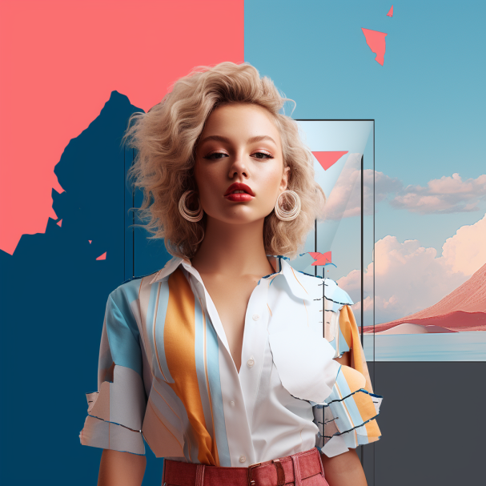

# VR Background Removal and DALL-E Integration App

**BRING YOUR IMAGES TO LIFE WITH OUR REVOLUTIONARY VR APP – A XREV STUDIO INNOVATION**

## About VR Background Removal and DALL-E Integration App

Dive into the world of virtual reality with our state-of-the-art app, combining the power of background removal and DALL-E generated images. Simply upload your photo, watch as the background disappears, and then bring it to a whole new dimension with customizable backgrounds generated through DALL-E prompts.

## Details

### Description

- Experience the next level of photo editing with a VR environment where you can interact with your photos like never before.
- Remove backgrounds from your photos with a single click using our advanced AI technology.
- Generate stunning backgrounds with DALL-E by providing a creative prompt.
- Create breathtaking compositions by integrating your edited photos with DALL-E generated backgrounds.
- Share your creations with the world and amaze everyone with your VR crafted artworks.

### Features

- **Background Removal**: Easily remove backgrounds from your images with advanced AI algorithms.
- **DALL-E Integration**: Generate unique backgrounds using DALL-E with just a simple prompt.
- **VR Interaction**: Interact with your images in a 3D VR space, adjusting and positioning them as you wish.
- **High-Resolution Support**: Support for high-resolution images, ensuring your creations are of the highest quality.
- **Social Sharing**: Share your artistic creations on social platforms directly from the app.

### How It Works

1. **Upload Your Image**: Start by uploading the image you want to edit.
2. **Remove Background**: Use the background removal tool to cleanly remove the background.
3. **Generate Background with DALL-E**: Provide a creative prompt to DALL-E to generate a new background.
4. **Combine Images**: Merge your original image with the new background seamlessly.
5. **Save & Share**: Save your creation and share it with your friends and on social media platforms.

---

© XRev Studio. All rights reserved.
